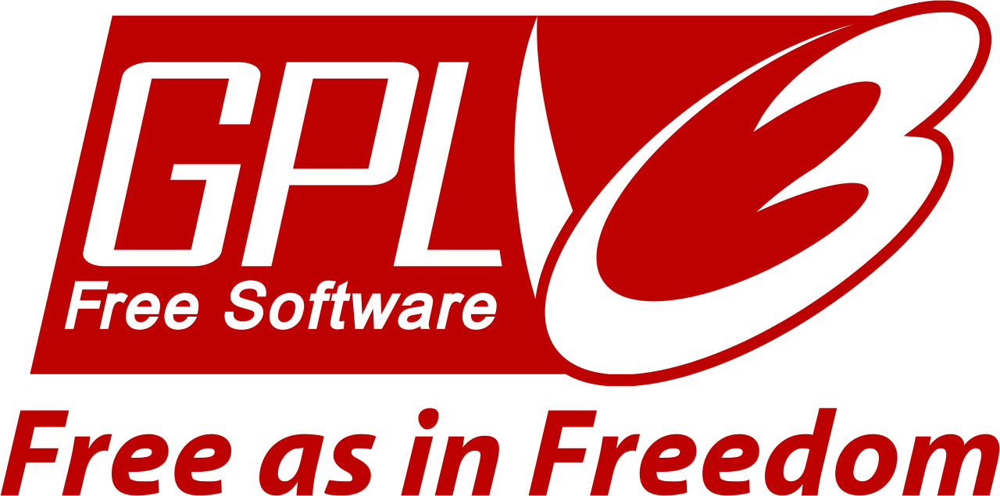

# SRCompiler

<p align="center">
  
</p>

## Table of contents
* [General Info](#general-info)
* [Building and prerequisites](#building-and-prerequisites)
* [Usage](#usage)
* [Builtins and Operators Implemented](#builtins-and-operators-implemented)
* [Contact](#contact)
* [License](license)

## General Info
Export Stella models to R scripts.

## Building and prerequisites
If you want to build the project, you will need a C++ compiler, Bison, Flex and Make installed.

Simply run:
```
$ build.sh
```

## Usage:
1. First, export your Stella model to .txt format:  
Tool Bar -> Model -> Equation Viewer 
  
2. Run the following commands on terminal:
```
$ SRCompiler [path/to/stella_model.txt]
```

:warning: NOTE: we recommend stick to the format of example files as close as possible to avoid compilation errors     
## Builtins and Operators Implemented:
:construction:  -> Under development  
:stop_sign:     -> Not developed  
:tada:          -> Already done!!  

|Builtin Section|    Process    |
| ------------- | ------------- |
|     Array     |  :stop_sign:  |
|   Cycle-time  |  :stop_sign:  |
|     Data      |:construction: |
|     Delay     |  :stop_sign:  |
|    Discrete   |  :stop_sign:  |
|    Financial  |  :stop_sign:  |
|    Logical    |    :tada:     |
|  Mathematical |    :tada:     |
| Miscellaneous |  :stop_sign:  |
|   Simulation  |:construction: |
|  Statistical  |  :stop_sign:  |
|   Test Input  |  :stop_sign:  |
| Trigonometric |    :tada:     |

The followings are exceptions inside of builtin sections: 
* Mathematical Builtins:
    * DERIVN    -> :stop_sign:  
* Miscellaneous Builtins:
    * COUNTER   -> :tada:  
    * TREND     -> :tada:
* Statistical Builtins:
    * NORMAL    -> :tada:
    * POISON    -> :tada:
    * LOGNORMAL -> :tada:
    * EXPRAND   -> :tada:
    * RANDOM    -> :tada:  

## Contact:
If you ever have any questions, feel free to make an issue here on GitHub.

## License:
<p align="center">
  
</p>

SRCompiler is Free Software: You can use, study share and improve it at your will. Specifically you can redistribute and/or modify it under the terms of the GNU General Public License as published by the Free Software Foundation, either version 3 of the License, or (at your option) any later version.
